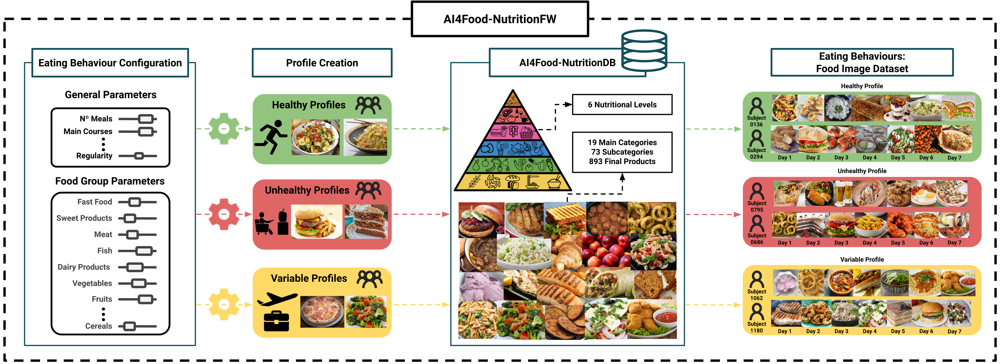

<a href="http://atvs.ii.uam.es/atvs/">
    
</a>

# AI4Food-NutritionFW

Welcome to the AI4Food-NutritionFW GitHub repository!

## Introduction

In this repository, you will find a framework designed to create food image datasets according to configurable eating behaviours. The [AI4Food-NutritionFW](https://arxiv.org/pdf/2309.06308.pdf) framework considers various aspects such as region and lifestyle and simulates a user-friendly scenario where food images are taken using a smartphone. Additionally, it is supported by the [AI4Food-NutritionDB](https://github.com/BiDAlab/AI4Food-NutritionDB), a comprehensive nutrition database that includes food images and a nutrition taxonomy.

## Getting Started

To get started with AI4Food-NutritionFW, follow the instructions in the respective sections of this repository. For any questions, issues, or collaborations, please don't hesitate to [contact us](#cite).

## Table of Contents

- [Overview](#overview)  
    - [AI4Food-NutritionFW Framework](#ai4foodfw)
    - [Eating Behaviour Configuration and Profile Creation](#firsts_modules)
    - [AI4Food-NutritionDB and Food Image Dataset Generation](#lasts_modules)
- [Citation](#cite)
- [Contact](#contact)

## <a name="overview">Overview<a>
Nowadays millions of images are shared on social media and web platforms. In particular, many of them are food images taken from a smartphone over time, providing information related to the individual's diet. On the other hand, eating behaviours are directly related to some of the most prevalent diseases in the world. Exploiting recent advances in image processing and Artificial Intelligence (AI), this scenario represents an excellent opportunity to: i) **create new methods that analyse the individuals' health from what they eat, and ii) develop personalised recommendations to improve nutrition and diet under specific circumstances (e.g., obesity or COVID)**. Having tunable tools for creating food image datasets that facilitate research in both lines is very much needed.

This repository proposes **AI4Food-NutritionFW, a framework for the creation of food image datasets according to configurable eating behaviours**. AI4Food-NutritionFW simulates a user-friendly and widespread scenario where images are taken using a smartphone. Finally, we automatically evaluate a healthy index of the subject's eating behaviours using multidimensional metrics based on guidelines for healthy diets proposed by international organisations.

### <a name="ai4foodfw">AI4Food-NutritionFW Framework<a>

<p align="center"></p>

As illustrated in the figure above, first, we define the general and food group parameters of the proposed framework to model the different eating behaviour configurations. After that, modifying previous parameters, we can define different profiles. Finally, with the help of the **AI4Food-NutritionDB**, we can generate datasets with different eating behaviours, select the number of subjects and profiles as desired, or even create new ones. All these tasks are **tunable, allowing researchers to build their own datasets and include different configurations**. The entire software implementation was done in Python, ensuring accessibility for all users.

### <a name="firsts_modules">Eating Behaviour Configuration and Profile Creation<a>
We initially define the parameters of the AI4Food-NutritionFW to characterise the different eating behaviour profiles. Specifically, we define 2 types of parameters based on general and food-related aspects. First, we consider 6 general parameters that describe the structure of the diet, and second, we provide a parameter for each food group found on the nutritional pyramids (75 in total). Consequently, all 81 parameters considered in this work must be configured to define each eating behaviour profile. These parameters determine the daily and weekly frequency intake of the food products corresponding to the individual's eating behaviour. As guidelines from international organisations are based on daily and weekly recommendations, we determine that all diets must follow a 7-day diet, simulating a natural week. We describe next the details of the general and food group parameters. 

Finally, each parameter is then adjusted within a range of values that define a new profile. A final value associated with each parameter is randomly generated between each range in order to differentiate subjects from the same profile, and also to generate different eating behaviours. This task requires a preliminary analysis from a general (comparison among profiles) to a specific point of view to build a reliable dataset. For instance, healthy eating profiles have intake frequencies related to the healthy recommendations and therefore, the parameters will be set according to these guidances. 

After determining the range of values that characterise each profile, the next step computes the parameter values for each unique subject. Random values within the possible ones are then computed to obtain the frequency of each specific parameter, for instance, for a healthy profile with 50 subjects, between 3 and 5 meals, and between 4 and 6 fruits per day, the AI4Food-NutritionFW will be set to each subject a unique value in these ranges. In addition, a balancing process is then executed to have a realistic distribution of values: as parameters are related to food groups and food intake nutritional levels, each frequency is properly distributed among weeks and days.

For more information, please visit [our article](https://arxiv.org/pdf/2309.06308.pdf).

### <a name="lasts_modules">AI4Food-NutritionDB and Food Image Dataset Generation<a>
One of the main contributions of the proposed **AI4Food-NutritionFW** is to simulate a real environment where people take a picture of food images, providing information related to their eating behaviours. This is done by automatically selecting food images based on the chosen configuration from a large pool of realistic and diverse images: the [AI4Food-NutritionDB database](https://github.com/BiDAlab/AI4Food-NutritionDB), the first database that considers food images and a nutrition taxonomy based on recommendations by national and international organisations, including four different categorisations: 6 different nutritional levels defined in accordance to the food intake frequency, 19 main food categories (e.g., “Meat”), 73 food subcategories (e.g., “White Meat”), and 893 final food products (e.g., “Chicken”). As the food group parameters of our proposed AI4Food-NutritionFW are directly related to the food image database, a food image of the corresponding group is randomly selected for each meal and day, recreating a realistic situation. The world region is the only restriction considered. Finally, this task is repeated among all the subjects and profiles designed previously and, as a result, a new dataset is generated.

**NOTE: We plan to update the repository frequently, making the remaining sections and material available as soon as possible.**

## <a name="cite">Citation<a>
[Link to arXiv.](https://arxiv.org/pdf/2309.06308.pdf)

- **[AI4Food-NutritionFW_2023]** S. Romero-Tapiador,  R. Tolosana, A. Morales, J. Fierrez, R. Vera-Rodriguez, I. Espinosa-Salinas, E. Carrillo-de Santa Pau, A. Ramirez-de Molina and J. Ortega-Garcia, **"AI4Food-NutritionFW: A Novel Framework for the Automatic Synthesis and Analysis of Eating Behaviours"**, arXiv preprint arXiv:2309.06308, 2023.

  ```
  @article{romerotapiador2023ai4foodnutritionfw,
      title={AI4Food-NutritionFW: A Novel Framework for the Automatic Synthesis and Analysis of Eating Behaviours}, 
      author={Sergio Romero-Tapiador and Ruben Tolosana and Aythami Morales and Isabel Espinosa-Salinas and Gala Freixer and Julian Fierrez and Ruben Vera-Rodriguez and Enrique Carrillo de Santa Pau and Ana Ramírez de Molina and Javier Ortega-Garcia},
      year={2023},
      journal={arXiv preprint arXiv:2309.06308}
    }
  ```
    
All these articles are publicly available in the [publications](http://atvs.ii.uam.es/atvs/listpublications.do) section of the BiDA-Lab group webpage. Please, remember to reference the above articles on any work made public.
    
## <a name="contact">Contact<a>
  
For more information, please contact us via email at [sergio.romero@uam.es](mailto:sergio.romero@uam.es) or [ruben.tolosana@uam.es](mailto:ruben.tolosana@uam.es). 

